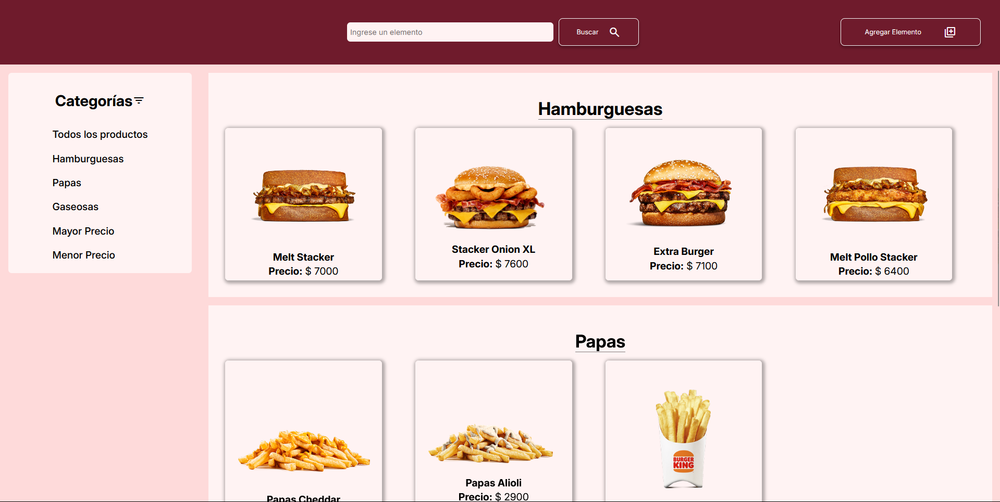
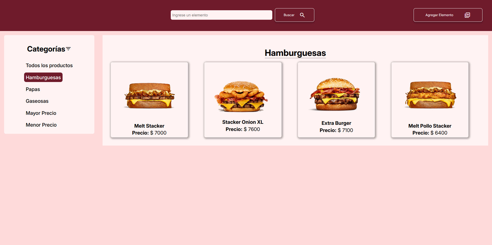
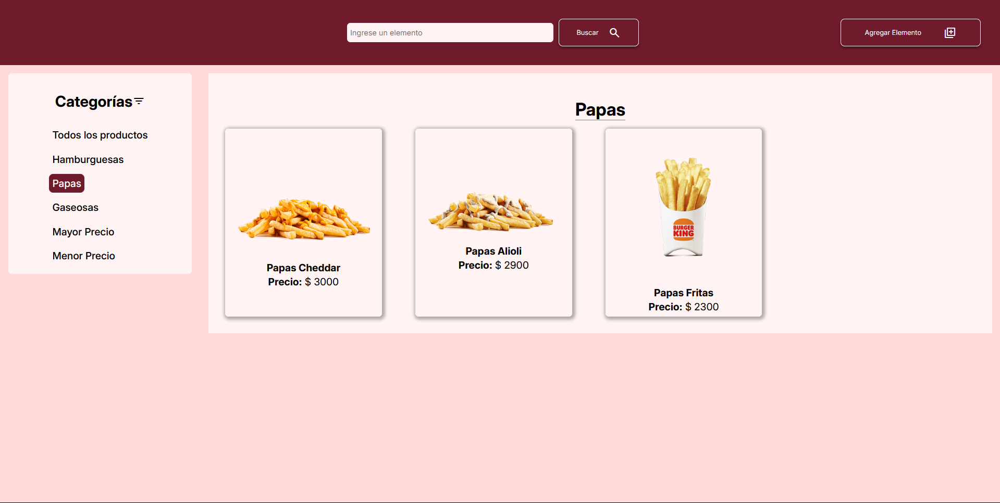
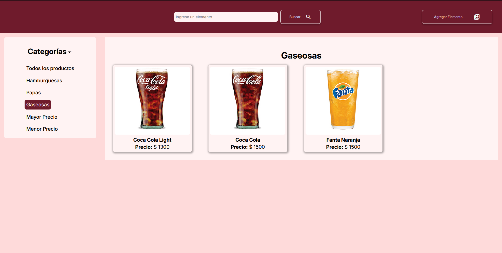
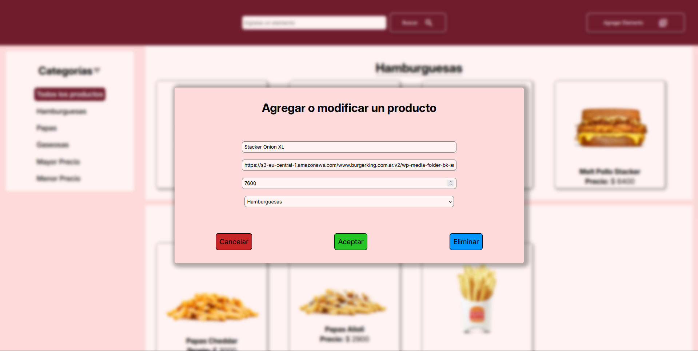

# PROYECTO INTEGRADOR FRONT HTML-CSS-JAVASCRIPT
Gonzalo Van Megroot - 3K10 - Desarrollo de Software - Universidad Tecnológica Nacional, Mendoza

## Capturas de Pantalla

## Deployment

Link del Vercel:

https://integrador-front-wine.vercel.app/

## Tecnologías Utilizadas

- HTML
- CSS
- JavaScript
- NodeJs
- Vite

## Imagenes utilizadas en ejemplo (Links)

- https://s3-eu-central-1.amazonaws.com/www.burgerking.com.ar.v2/wp-media-folder-bk-argentina/home/ubuntu/preview/menu-app/frontend/apps/marketing-website-wordpress-app/web/app/uploads/sites/5/Melt-con-Salsa-Stacker-2.png
- https://s3-eu-central-1.amazonaws.com/www.burgerking.com.ar.v2/wp-media-folder-bk-argentina/home/ubuntu/preview/menu-app/frontend/apps/marketing-website-wordpress-app/web/app/uploads/sites/5/Stacker-Onion-XL.png
- https://s3-eu-central-1.amazonaws.com/www.burgerking.com.ar.v2/wp-media-folder-bk-argentina/home/ubuntu/preview/menu-app/frontend/apps/marketing-website-wordpress-app/web/app/uploads/sites/5/Extra-burger.png
- https://s3-eu-central-1.amazonaws.com/www.burgerking.com.ar.v2/wp-media-folder-bk-argentina/home/ubuntu/preview/menu-app/frontend/apps/marketing-website-wordpress-app/web/app/uploads/sites/5/Papas-Cheddar-1.png
- https://bk-latam-prod.s3.amazonaws.com/sites/burgerking.latam/files/BK_Web_COCACOLALIGHT_300x270px_0.jpg

